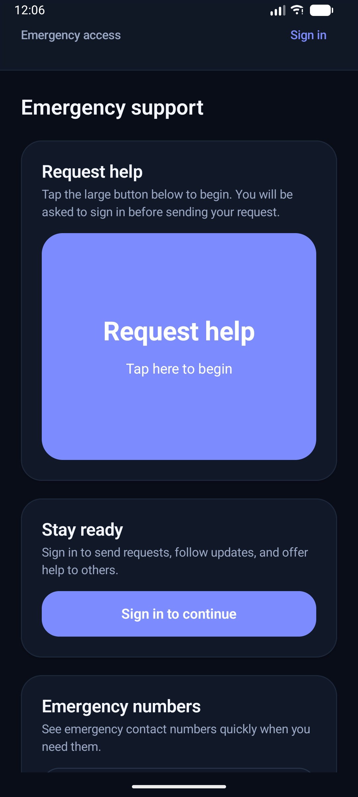
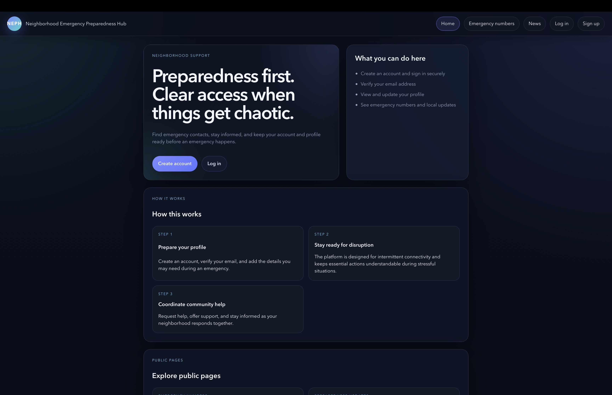

# Neighborhood Emergency Preparedness Hub (NEPH)

**CMPE354 Group 6**

A disaster preparedness platform designed to help neighbors request and coordinate support, with an emphasis on offline readiness during emergencies.

## Current Status

This repository currently reflects the **MVP stage** of the product.

The current MVP includes:
- a Node.js + Express backend with auth, profiles, help requests, and volunteer availability
- a web portal for public pages, sign in, profile management, and basic admin views
- an Android client for emergency-facing request and volunteer flows

<div align="center">
  
  &nbsp;&nbsp;&nbsp;&nbsp;
  
</div>


## Project Structure
| Directory | Role | Tech Stack |
|-----------|------|------------|
| `backend/` | API and business logic | Node.js, Express |
| `web/` | Public web portal, profile flow, admin basics | React, Vite, TypeScript |
| `android/` | Emergency mobile client | Kotlin, Jetpack Compose |
| `infra/` | Databases & Configuration | Docker, PostgreSQL |

## Quick Start

To run the current MVP locally:

1. **Database:** (Requires Docker)
   ```bash
   cd infra/dcompose
   cp .env.example .env
   docker compose -f docker-compose-dev.yml up -d
   ```
2. **Backend API:** (Requires Node 20)
   ```bash
   cd backend
   cp .env.example .env
   npm install && npm run dev
   ```
   API: `http://localhost:3000`

3. **Web Portal:**
   ```bash
   cd web
   cp .env.example .env
   npm install && npm run dev
   ```
   Web app: `http://localhost:5173`

## Web Usage

After starting the backend and web client:
- open `http://localhost:5173`
- use the public pages without signing in
- sign in to access profile management
- sign in with an admin account to access admin views

## Android Quick Start

To build the Android client:

```bash
cd android
./gradlew :app:assembleDebug
```

The debug APK will be created at:

```text
android/app/build/outputs/apk/debug/app-debug.apk
```

### Run on an Emulator
- start an Android emulator from Android Studio
- make sure the backend is running on your machine
- install the debug APK to the emulator
- the app opens into the emergency hub

### Run on a Physical Device
- connect the device with USB debugging enabled
- keep the backend running locally
- forward the backend port to the device:

```bash
adb reverse tcp:3000 tcp:3000
```

- then install and open the debug APK

## MVP Feature Overview

### Web
- public pages
- authentication
- profile and privacy management
- basic admin views

### Android
- emergency-first home screen
- help request creation and request tracking
- volunteer availability and assignment actions
- emergency contact numbers

## Notes

- do not place real credentials inside committed `.env` files
- the PostgreSQL schema source of truth is `infra/docker/postgres/init.sql`
